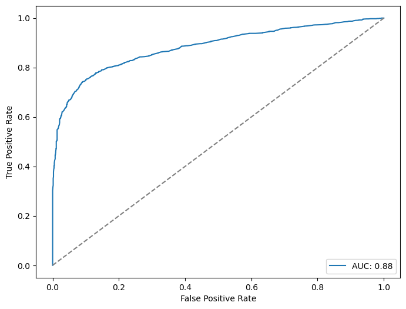
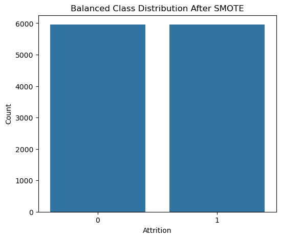
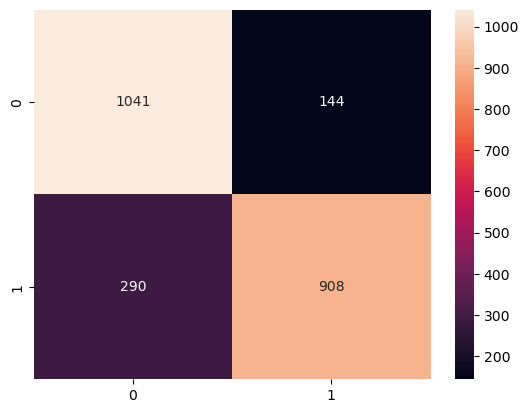
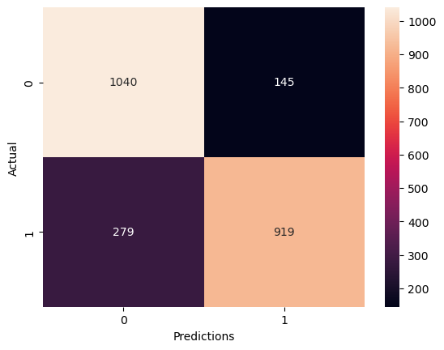
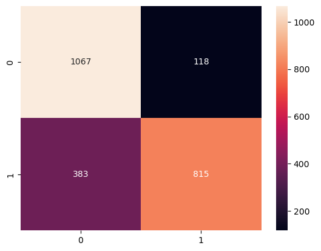
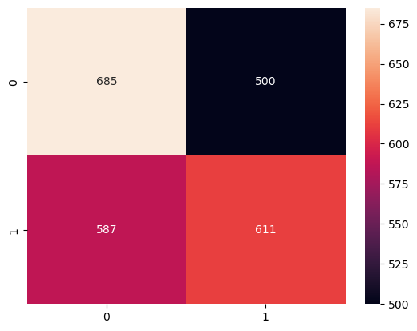
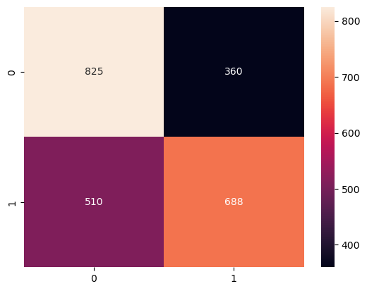
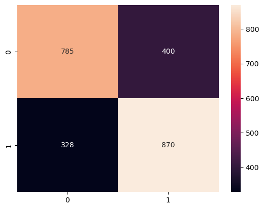

# Employee Attrition Prediction

## Project Overview
This project uses machine learning techniques to predict employee attrition based on HR analytics data. The goal is to identify employees who are likely to leave the company and understand the factors influencing attrition.

---

## Objectives
- Perform exploratory data analysis (EDA)
- Clean and preprocess the dataset
- Handle class imbalance using SMOTE
- Train multiple machine learning models
- Evaluate model performance
- Predict employee attrition accurately

---

## Tools and Technologies
- Python
- Pandas
- NumPy
- Matplotlib
- Seaborn
- Scikit-learn
- XGBoost
- Jupyter Notebook

---

## Machine Learning Models Used
- Logistic Regression
- Decision Tree
- Random Forest
- Gradient Boosting
- AdaBoost
- K-Nearest Neighbors
- Support Vector Machine
- XGBoost

---

## Project Workflow
1. Data Collection
2. Data Cleaning
3. Exploratory Data Analysis
4. Feature Encoding
5. Feature Scaling
6. Handling Imbalanced Data
7. Model Training
8. Model Evaluation
9. Prediction and Insights

---

## Evaluation Metrics
- Accuracy
- Precision
- Recall
- F1-Score
- ROC-AUC Score
- Confusion Matrix

---

## Key Insights
- Overtime and job satisfaction significantly influence attrition.
- Employees with low work-life balance are more likely to leave.
- Machine learning models can effectively predict attrition risk.

---

## Files Included
- `Employee_Attrition_Prediction.ipynb`
- `employee_attrition.csv`
- `requirements.txt`
- `README.md`

---

## Visualizations

### ROC Curve

### SMOTE Balanced Distribution

### Random Forest Confusion Matrix

### Tuned Random Forest Confusion Matrix

### XGBoost Confusion Matrix

### Logistic Regression Confusion Matrix

### AdaBoost Confusion Matrix

### Decision Tree Confusion Matrix

## Results
The tuned Random Forest and XGBoost models achieved strong predictive performance in identifying employee attrition patterns.

## Author
Sadiq Favour Momodu